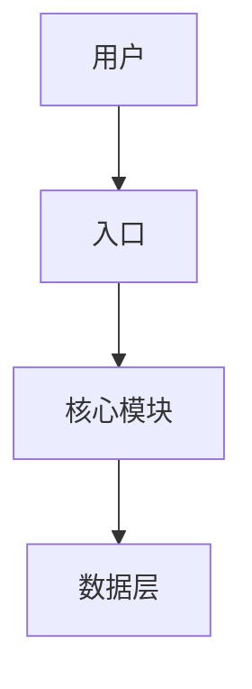
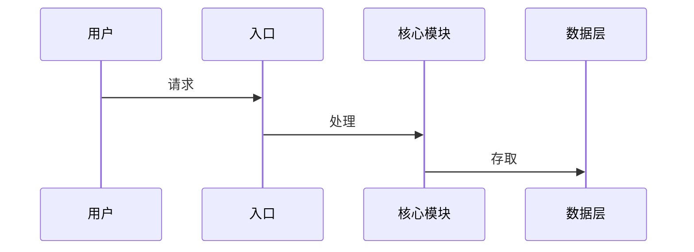
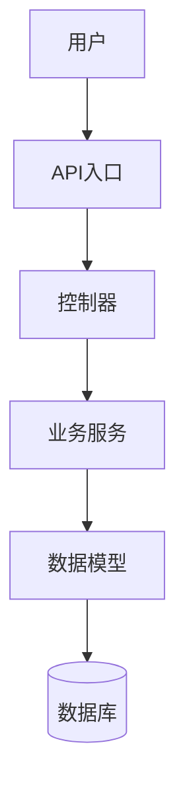
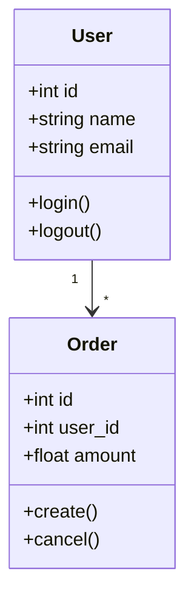
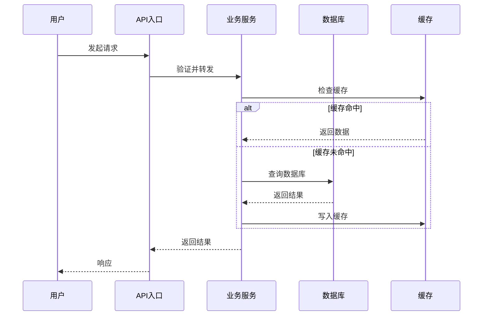
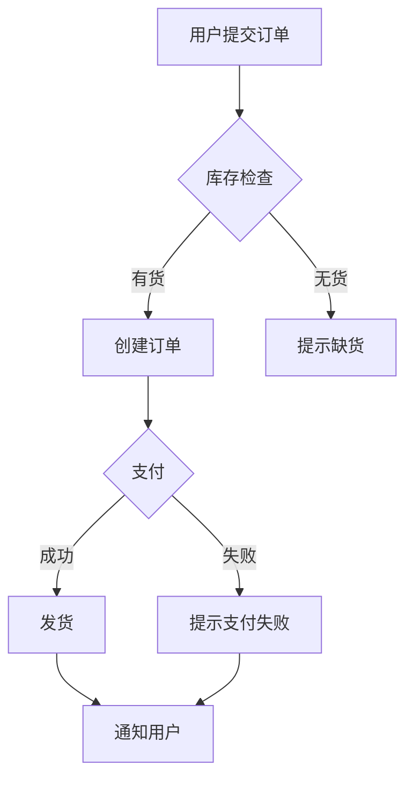
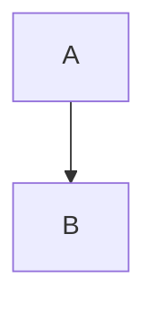

# GitHub 代码分析器

## 概述

接收GitHub仓库链接，自动完成全部分析流程，生成产品经理易懂的Markdown分析报告。**无需用户确认每一步**，分析完成后：
1. 直接输出Markdown报告
2. 自动生成飞书文档（包含架构图）

## 使用场景

- 产品经理需要了解竞品的技术实现
- 技术人员需要向产品经理解释代码逻辑
- 团队成员需要快速理解新项目的架构

## 自动化分析流程

用户发送GitHub链接后，**自动执行以下全部步骤，无需询问用户**：

### 第1步：克隆与分析（自动）

1. 解析GitHub链接
2. 克隆仓库到临时目录
3. 自动检测技术栈、语言、目录结构
4. 查找入口文件和核心模块

### 第2步：深度代码分析（自动）

对以下关键文件进行自动分析：
- 入口文件（main, app, index, server）
- 核心模块（models, services, controllers）
- 配置文件

### 第3步：生成报告（自动）

1. 输出Markdown格式完整报告
2. 生成飞书文档（包含Mermaid架构图）

---

## 飞书文档生成

### 文档结构

飞书文档包含以下内容：

```markdown
# [项目名称] 代码分析报告

## 一、项目概览
| 项目 | 信息 |
|------|------|
| 项目名称 | xxx |
| GitHub链接 | xxx |
| 主要语言 | xxx |
| 项目描述 | xxx |

## 二、技术架构（带架构图）
### 技术栈
### 架构图（Mermaid）


## 三、核心模块分析
### 模块1: xxx
- 职责: xxx
- 核心代码: xxx
- 数据结构: xxx

## 四、数据流程


## 五、核心业务逻辑
### 场景1: xxx
- 业务流程
- 关键代码位置
- 实现要点

## 六、总结
- 技术特点
- 业务价值
- 适用场景
```

### Mermaid图表类型

根据内容类型生成对应的Mermaid图：

1. **架构图** - `graph TD` 或 `graph LR`
   - 展示系统组件和关系

2. **流程图** - `flowchart TD`
   - 展示业务流程

3. **时序图** - `sequenceDiagram`
   - 展示数据流动

4. **类图** - `classDiagram`
   - 展示数据结构

---

## 分析报告模板

```markdown
# [项目名称] 代码分析报告

## 一、项目概览

| 项目 | 信息 |
|------|------|
| 项目名称 | [名称] |
| GitHub链接 | [链接] |
| 主要语言 | [语言] |
| 项目描述 | [从README提取] |

### 核心功能
- [功能1]
- [功能2]
- [功能3]

---

## 二、技术架构

### 技术栈

| 类别 | 技术 |
|------|------|
| 编程语言 | [主要语言] |
| 框架 | [框架1, 框架2] |
| 关键依赖 | [dep1, dep2, dep3] |

### 架构图



### 目录结构

```
[项目根目录]
├── [目录1]/          # [职责说明]
├── [目录2]/          # [职责说明]
├── [目录3]/          # [职责说明]
└── [配置文件]        # [作用说明]
```

---

## 三、核心模块分析

### 模块1: [模块名称]

**职责**: [模块做什么]

**关键文件**:
- `path/to/file1.py`
- `path/to/file2.py`

#### 核心代码实现

**[关键类/函数名]** (`文件:行号`)

```python
# 关键代码片段
def core_function(param):
    """这段代码做什么"""
    # 实现逻辑
    pass
```

**代码解读**: [用通俗语言解释这段代码在做什么]

**依赖**: [调用了哪些其他模块/函数]

#### 数据结构



| 结构 | 用途 |
|------|------|
| [Struct Name] | [用途说明] |

---

## 四、数据流程

### 核心流程



### 关键接口

| 接口 | 方法 | 功能 |
|------|------|------|
| /api/xxx | GET/POST | [功能说明] |

### 数据存储

- [存储方式1]: [说明]
- [存储方式2]: [说明]

---

## 五、核心业务逻辑

### 业务场景1: [场景名称]

**业务流程**:



1. [步骤1: 用户做什么]
2. [步骤2: 系统做什么]
3. [步骤3: 结果是什么]

**关键代码位置**: `path/to/file.py` (函数名)

**实现要点**:
- [要点1]
- [要点2]

---

## 六、总结

### 技术特点
- [特点1]
- [特点2]

### 业务价值
- [价值1]
- [价值2]

### 适用场景
- [场景1]
- [场景2]

### 注意事项
- [技术债务/限制/坑]
```

---

## 代码分析要点

### 理解代码的提问框架

对于每个核心代码片段，回答：

1. **这段代码做什么？** - 功能描述
2. **为什么这样实现？** - 设计考量
3. **如何被调用？** - 调用关系
4. **数据从哪里来？** - 输入来源
5. **结果送到哪里？** - 输出去向

### 代码解释技巧

- 避免直接贴代码，用自然语言描述
- 使用"如果...那么..."的逻辑描述
- 必要时展示关键代码行并解释
- 区分"什么是API"这类术语并解释

### 产品视角转换

| 技术术语 | 产品语言 |
|----------|----------|
| API接口 | 用户和系统对话的方式 |
| 数据库 | 存储数据的地方 |
| 缓存 | 加快访问速度的临时存储 |
| 异步处理 | 后台慢慢处理，不让用户等 |
| 鉴权 | 验证用户身份 |

---

## 执行命令

### 步骤1：运行分析脚本

```bash
python3 /Users/bytedance/.claude/skills/github-code-analyzer/scripts/analyze_github.py <github_url>
```

### 步骤2：根据输出自动分析

根据脚本输出的结构，读取关键文件进行深度分析。

### 步骤3：生成报告

1. 输出Markdown格式完整报告（终端显示）
2. 生成飞书文档内容（包含Mermaid图表）

---

## 飞书文档输出格式

生成飞书文档时，使用以下格式：

```
# 标题

## 一、项目概览
| 表格 | 内容 |

## 二、技术架构


## 三、核心模块分析
...

---
*本报告由 GitHub Code Analyzer 自动生成*
```

---

## 输出要求

1. **语言风格**: 专业但易懂，避免过度技术术语
2. **结构清晰**: 使用Markdown标题层级
3. **图表优先**: 核心内容用Mermaid图表展示
4. **代码解释**: 关键代码需附带通俗解释
5. **飞书兼容**: 生成的文档可直接复制到飞书

---

## 重要规则

1. **全自动执行**: 用户发送链接后，直接开始分析，不要询问确认
2. **一次性输出**: 分析完成后，直接输出完整Markdown报告和飞书文档内容
3. **图表优先**: 架构、流程、数据流优先使用Mermaid图表
4. **不要中断**: 除非遇到严重错误，否则不要停止分析
5. **克隆使用 --depth 1**: 只获取最新代码，加快速度
6. **优先分析入口文件和核心模块**
7. **不要逐行解释代码**，抓住核心逻辑即可
8. **报告长度**: 根据项目复杂度控制在 2000-5000 字
