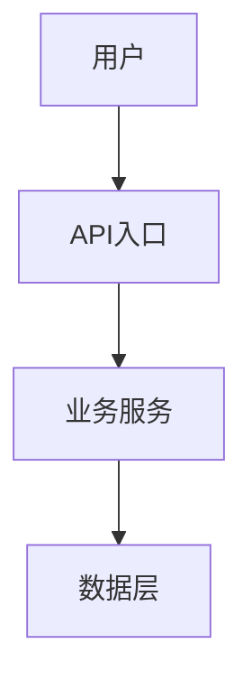
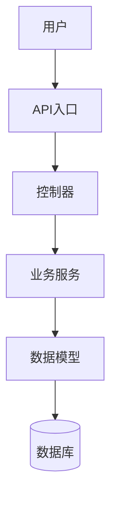
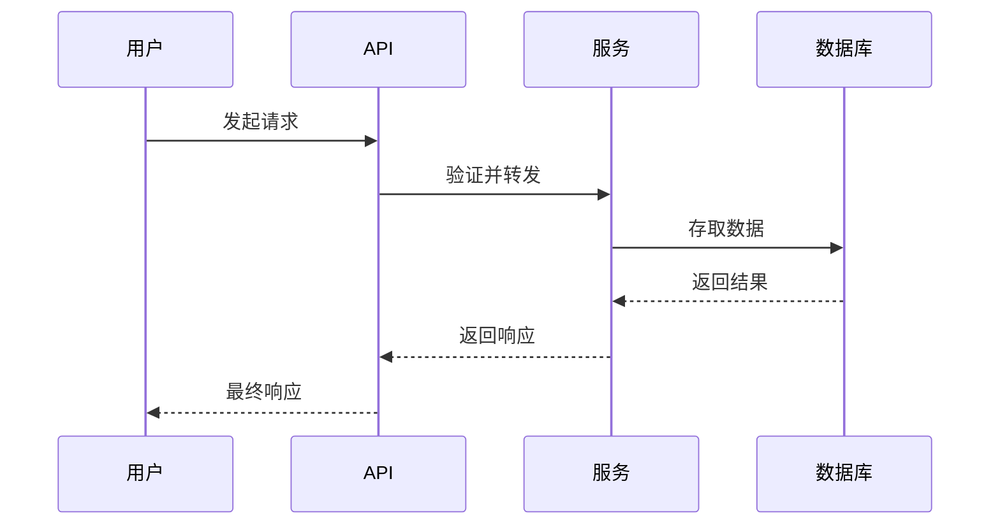

# GitHub 代码分析器

## 概述

接收GitHub仓库链接，自动完成全部分析流程，生成产品经理易懂的Markdown分析报告。**无需用户确认每一步**，分析完成后：
1. 直接输出Markdown报告
2. 自动生成飞书文档（包含架构图）

## 使用场景

- 产品经理需要了解竞品的技术实现
- 技术人员需要向产品经理解释代码逻辑
- 团队成员需要快速理解新项目的架构

## 自动化分析流程

用户发送GitHub链接后，**自动执行以下全部步骤，无需询问用户**：

### 第1步：克隆与分析（自动）

1. 解析GitHub链接
2. 克隆仓库到临时目录
3. 自动检测技术栈、语言、目录结构
4. 查找入口文件和核心模块

### 第2步：深度代码分析（自动）

对以下关键文件进行自动分析：
- 入口文件（main, app, index, server）
- 核心模块（models, services, controllers）
- 配置文件

### 第3步：生成报告（自动）

1. 输出Markdown格式完整报告
2. 生成飞书文档（包含架构图）

---

## 飞书文档格式

飞书支持以下图表格式，按优先级使用：

### 1. 飞书文档图表（推荐）

飞书云文档支持插入「智能分析」图表，在报告中用以下格式标注：

```
┌─────────────────────────────────────┐
│         架构图建议内容              │
├─────────────────────────────────────┤
│  用户 → API入口 → 业务服务 → 数据层  │
│                                     │
│  (请在飞书中插入对应的流程图)        │
└─────────────────────────────────────┘
```

### 2. Mermaid代码块



**飞书中使用方式**：复制代码块内容到 https://mermaid.live/ 生成图片，然后插入飞书

### 3. ASCII流程图（通用备选）

当无法使用图表时，使用ASCII流程图：

```
┌──────────┐    ┌──────────┐    ┌──────────┐    ┌──────────┐
│   用户   │ -> │ API入口  │ -> │ 业务服务 │ -> │  数据层  │
└──────────┘    └──────────┘    └──────────┘    └──────────┘
```

---

## 报告模板

### 飞书文档结构

```markdown
# [项目名称] 代码分析报告

## 一、项目概览

| 项目 | 信息 |
|------|------|
| 项目名称 | xxx |
| GitHub链接 | xxx |
| 主要语言 | xxx |
| 项目描述 | xxx |

### 核心功能
- 功能1
- 功能2
- 功能3

---

## 二、技术架构

### 技术栈
| 类别 | 技术 |
|------|------|
| 编程语言 | xxx |
| 框架 | xxx |
| 关键依赖 | xxx |

### 目录结构
```
项目根目录/
├── src/           # 源代码
├── tests/         # 测试
└── config/        # 配置
```

### 系统架构图



> 💡 **提示**：将上述Mermaid代码复制到 https://mermaid.live/ 生成图片，然后插入飞书

---

## 三、核心模块分析

### 模块1: [模块名称]

**职责**: [模块功能描述]

**关键文件**: `path/to/file.py`

**核心代码**:
```python
def core_function(param):
    """用通俗语言解释这段代码在做什么"""
    # 关键逻辑
    pass
```

**依赖**: 调用了xxx模块

---

## 四、数据流程

### 请求处理流程



### 关键接口
| 接口 | 方法 | 功能 |
|------|------|------|
| /api/xxx | GET/POST | 功能说明 |

---

## 五、核心业务逻辑

### 业务流程

```
用户提交 -> 验证 -> 处理 -> 返回结果
    ↓
  失败 -> 提示错误
  成功 -> 返回数据
```

---

## 六、总结

### 技术特点
- 特点1
- 特点2

### 业务价值
- 价值1
- 价值2

### 适用场景
- 场景1
- 场景2

---

*本报告由 GitHub Code Analyzer 自动生成*
```

---

## 代码分析要点

### 理解代码的提问框架

对于每个核心代码片段，回答：

1. **这段代码做什么？** - 功能描述
2. **为什么这样实现？** - 设计考量
3. **如何被调用？** - 调用关系
4. **数据从哪里来？** - 输入来源
5. **结果送到哪里？** - 输出去向

### 代码解释技巧

- 避免直接贴代码，用自然语言描述
- 使用"如果...那么..."的逻辑描述
- 必要时展示关键代码行并解释
- 区分"什么是API"这类术语并解释

### 产品视角转换

| 技术术语 | 产品语言 |
|----------|----------|
| API接口 | 用户和系统对话的方式 |
| 数据库 | 存储数据的地方 |
| 缓存 | 加快访问速度的临时存储 |
| 异步处理 | 后台慢慢处理，不让用户等 |
| 鉴权 | 验证用户身份 |

---

## 执行流程

1. 运行分析脚本获取项目结构
2. 读取关键文件进行深度分析
3. 生成Markdown报告
4. 同时输出飞书兼容格式

---

## 输出要求

1. **语言风格**: 专业但易懂
2. **结构清晰**: 使用Markdown标题层级
3. **图表说明**:
   - 主要使用Mermaid代码块
   - 附带生成图片的提示
   - 提供ASCII备选
4. **飞书提示**: 关键图表旁边添加飞书使用提示

---

## 重要规则

1. **全自动执行**: 用户发送链接后，直接开始分析
2. **一次性输出**: 同时输出Markdown和飞书格式
3. **图表优先级**:
   - Mermaid代码块（主要）
   - ASCII流程图（备选）
   - 附带生成图片的提示
4. **不要中断**: 除非严重错误
5. **克隆使用 --depth 1**: 只获取最新代码
6. **报告长度**: 2000-5000字
